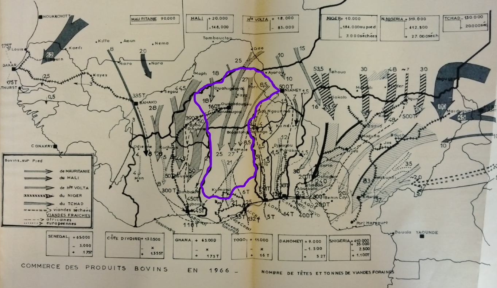

## Preservation Technology: Refrigeration and the Meat Trade, 1940s to 1970s

 

Ryan Carty, PhD Candidate, History, Michigan State University

note: 

---

<small>"L'approvisionnement en viande de l'Afrique du Centre Ouest : cartes d'ensemble et extrait du titre IV. 1966-1967." National Archives, 30V188, Ouagadougou, Burkina Faso.</small>

note: 

---

## Fresh Meat

note: 

-----

<small>Offinsuhene to District Commissioner, Kumasi, August 13, 1940, Regional Office Kumasi, ARG6/1/124, PRAAD.</small>

note: 

---

## Refrigerated Meat

note: 

-----

<small>*Ashanti Pioneer*, April 18, 1962.</small>

note: 

-----

<small>J.E. Seyire (Chairman), “Opening Address,” May 2, 1967, 662, Regional Administration, NRG9/4/41, PRAAD, Tamale, Ghana.</small>

note: 

---

## Foreign Meat

note: 

-----

<small>Cattle Development Board, “Annual Report, 1973/1974 Financial Year,” 1974, Library, Veterinary Services Directorate, Accra, Ghana.</small>

note: 

---

## Conclusion

<!--Picture of meat for sale?-->

note: 